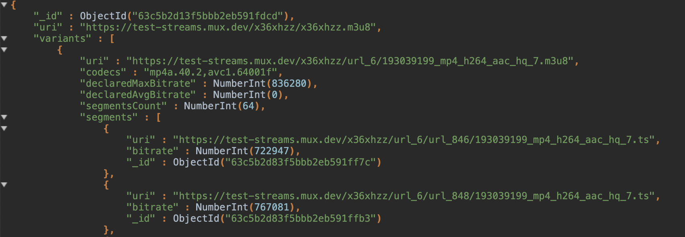
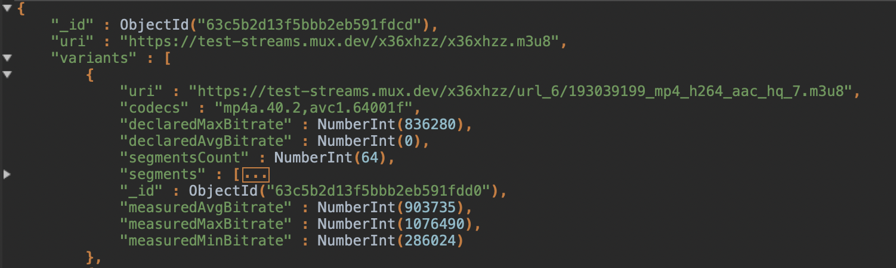

# HLS VARIANT INFO

## Features

1. Calculate bitrate of each stream variant segment.
2. Aggregate min, max and average bitrate values for each stream variant.
3. Compute VMAF score for each stream variant.

## Prerequisites

1. [Docker](https://www.docker.com)
2. [Node package manager](https://www.npmjs.com)

## Installation

1. Clone repository

    ```zsh
    git clone https://github.com/maciej-kulon/hls-variants-info.git ~/Documents/repos/hls-variants-info
    ```

2. Enter project directory
  
    ```zsh
    cd ~/Documents/repos/hls-variants-info
    ```

3. Run command

    ```zsh
    npm install && npm run docker
    ```
    <a style="color:yellow" >PLEASE NOTICE</a>: Building docker image for the first time may take up to an hour or even longer, depending on your hardware. FFmpeg with lots of enabled libraries and VMAF are compiled from source during docker build process.

## Usage

If `npm run docker` command has completed successfully, tool is ready to be used.


## Segments bitrates measurement

To measure segments bitrate values, min, max and average, HTTP request has to be send to `http://localhost:3000/hls-manifest` endpoint with `x-manifest-url` header pointing to HLS **MasterPlaylist** file.

```zsh
curl  -X POST http://localhost:3000/hls-manifest \
-H "x-manifest-url: http://example.hlsmanifest.m3u8" \
```

## VMAF score
<p align="center">

</p>


To perform VMAF assessment on your stream variants, send additional header along with the one from the example above: `x-original-video-url` pointing to original video file from which HLS **MasterPlaylist** has been created. Application take care of input data normalization. If distorted video (I assume it's HLS manifest) has different resolution or frame rate, app will scale distorted video to match the original video resolution. Frame rate will be set to a lower value, so if original video for some reason has lower framerate, then distorted video framerate will be decreased to match original one and the other way around.

### **Additional headers**:

`x-tag` - Add additional tag into the main document in MongoDB.

`x-vmaf-model` - Override model which will be used for VMAF calculations. VMAF model has to be whole path, not just the file name. Default model is set to `/usr/local/share/model/vmaf_v0.6.1.json`. Available models can be obtained by sending **GET** `http://localhost:3000/vmaf-models`- it will return array of paths to available VMAF models.

`x-enable-phone-model` - According to VMAF documentation, **DEFAULT** VMAF model can be switched to calculate VMAF score as it was being played on a cellphone display. This header should be **true** if you wanna use phone model. Otherwise just don't send this header since it's false by default.

## Browsing results

All results are stored in local instance of MongoDB in docker. You can browse result using such software as [MongoDB Compass](https://www.mongodb.com/products/compass), [MongoDB Shell](https://www.mongodb.com/try/download/shell) etc. Connect to the mongo DB using connection string:
`mongodb://root:root@$0.0.0.0:27017/hls-variants-info?tls=false&ssl=false&authSource=admin`

## Example results

Main document is a HLS MasterPlaylist. It has uri field which is basically a URL provided in `x-manifest-url` header. Inside there is an array of Variants, each variant contains segments with their measured bitrates.


Under the segments array some additional data is provided such as min, max and average bitrate from all stream variant segments.



Passing `x-original-video-url` will result in additional field **`vmafScore`** in each stream variant document.

## This project was built on top of other awesome opensource projects

Such as:

<div>
  
  <a href="https://github.com/Netflix/vmaf">VMAF - Video Multi-Method Assessment Fusion</a>
</div>

***

<div>
  
  <a href="https://github.com/jrottenberg/ffmpeg">  jrottenberg - github user with awesome docker solutions</a>
</div>

***

<div>
  
  <a href="https://ffmpeg.org">Ffmpeg - A complete, cross-platform solution to record, convert and stream audio and video.</a>
</div>

***

<div>
  
  <a href="https://nestjs.com">A progressive Node.js framework for building efficient, reliable and scalable server-side applications.</a>
</div>

***

<div>
  
  <a href="https://www.npmjs.com/package/got">Human-friendly and powerful HTTP request library for Node.js</a>
</div>

***

<div>
  
  <a href="https://www.npmjs.com/package/hls-parser">hls-parser - Provides synchronous functions to read/write HLS playlists</a>
</div>

***

<div>
  
  <a href="https://www.npmjs.com/package/mongoose">Mongoose is a MongoDB object modeling tool designed to work in an asynchronous environment.</a>
</div>

***

<div>
  
  <a href="https://www.npmjs.com/package/nestjs-rmq">This library will take care of RPC requests and messaging between microservices.</a>
</div>
